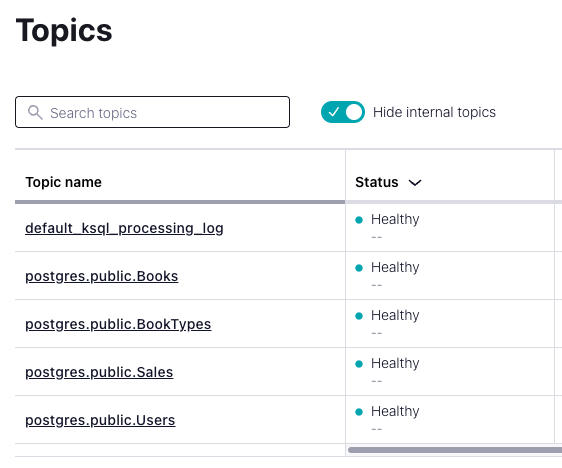
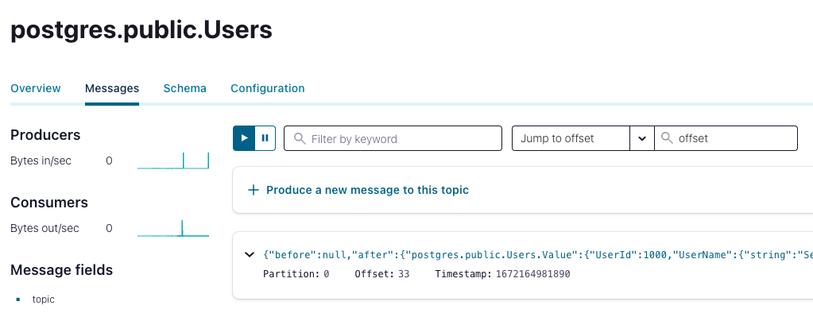
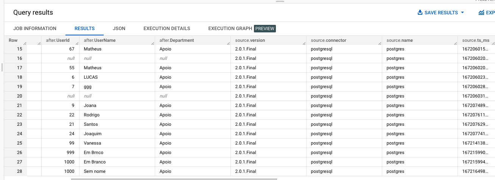

# POC-KafkaConnect
Este repositório tem por objetivo realizar uma POC utilizando o Kafka Connect ([Confluent Platform](https://developer.confluent.io/)), validando sua captura de dados de um banco de dados Postgres e registrando essa captura em uma tabela do Google Big Query.

## Setup do banco de dados
Essa POC utilizará um banco de dados Postgres. O banco de dados pode ser obtido facilmente utilizando a sua [imagem](https://hub.docker.com/_/postgres) Docker. 

Para baixar e configurar a imagem em um container diretamente via terminal, execute esse comando:

`docker run -d --name postgresql-container -p 5432:5432 -e POSTGRES_PASSWORD=postgres -e POSTGRES_USER=postgres -e POSTGRES_DB=postgres postgres`

Após executar o comando, o container com o banco de dados já estará rodando e disponível para acesso em: http://localhost:5432

Para os testes de CDC, é preciso criar uma ou mais tabelas no banco de dados para simular transações. [Aqui](scripts/create_tables.sql) está disponibilizado um script que já popula algunmas tabelas com dados de uma livraria fictícia. Também é necessário executar esse select no banco de dados para alterar o WAL LEVEL (nível de log gerado pelo Postgres), pois o Kafka Connect precisa de no mínimo um WAL LEVEL = `logical`.

`ALTER SYSTEM SET wal_level = logical;`

Reinicie o container para que a configuração possa ser aplicada na inicialização do banco de dados. Para validar se o WAL LEVEL está com o valor correto, execute:

`SHOW wal_level;`

Com o banco de dados rodando e com dados inseridos, seguimos para a configuração do Kafka Connect CE.

## Setup Kafka Connect - Confluent Platform
O passo-a-passo abaixo está seguindo os passos desse [link](https://docs.confluent.io/platform/current/platform-quickstart.html#step-1-download-and-start-cp
), utilizando o "Tar Archive˜. Para utilizar o arquivo .tar, é preciso que sua máquina tenha certos [pré-requisitos](https://docs.confluent.io/platform/current/platform-quickstart.html#prerequisites). É possível também utilizar a imagem Docker disponibilizada.

Execute os comandos conforme o passo-a-passo do link acima e será criado um serviço presente em http://localhost:9021/ onde teremos o Confluent Platform rodando.

Para realizar as integrações e validar o CDC é necessário baixar alguns plugins no [Confluent Hub](https://www.confluent.io/hub/).
### Plugin Debezium Postgresql

Para capturar as mensagens de transações de um banco de dados Postgresql utilizando o Kafka Connect será utilizado o plugin [Debezium PostgreSQL CDC Source Connector](https://www.confluent.io/hub/debezium/debezium-connector-postgresql). Baixe o pacote zip e insira o conteúdo na pasta `share/confluent-hub-components` do seu Confluent Platform instalado anteriormente. Sugiro essa pasta pois para capturar plugins o Confluent Platform utiliza um parâmetro `plugin.path` dentro de um arquivo localizado em `etc/schema-registry` e na configuração padrão do Confluent Platform essa é a pasta de plugins padrão.

### Plugin BigQuery
Para realizar o envio das mensagens capturadas pelo Kafka Connect para uma tabela no Google Big Query, é necessário baixar o plugin [Google BigQuery Sink Connector](https://www.confluent.io/hub/wepay/kafka-connect-bigquery). Baixe o pacote zip e insira o conteúdo na pasta `share/confluent-hub-components` do seu Confluent Platform instalado anteriormente. Sugiro essa pasta pois para capturar plugins o Confluent Platform utiliza um parâmetro `plugin.path` dentro de um arquivo localizado em `etc/schema-registry` e na configuração padrão do Confluent Platform essa é a pasta de plugins padrão.

Caso esteja utilizando Docker, será necessário inserir os arquivos no volume do container, nas mesmas pastas descritas acima.

⚠ APÓS O DOWNLOAD SERÁ NECESSÁRIO REINICIAR TODOS OS SERVIÇOS DO CONFLUENT PLATFORM ⚠ 

`confluent local services stop`

`confluent local services start`

Após reiniciar o Confluent Platform, os connectores instalados devem ser exibidos em Connect > connect-default > Add connector com os nomes `PostgresConnector` e `BigQuerySinkConnector`.

## Gerando mensagens de transações no banco de dados
Acesse o Confluent em http://localhost:9021/. Navegue em Connect > connect-default > Add connector.
Caso tenha seguido os passos para setup do banco de dados exatamente como este documento, basta utilizar [este](connectors/connector_postgres_config.json) arquivo clicando em `Upload connector config file` para configurar o seu connector. Ele basicamente é um JSON com as informações básicas de conexão ao banco Postgres e alguns parâmetros de conexão para o Kafka Connect. Caso tenha seu próprio banco de dados, basta alterar os parâmetros abaixo:

| Parâmetro | Informações |
| --- | --- |
| database.hostname | IP do banco de dados. | 
| database.port | Porta do banco de dados. |
| database.user | Usuário do para acesso ao banco de dados. |
| database.password | Senha do usuário. | 
| database.dbname | Nome do banco de dados. |

Aguarde alguns instantes até o connector iniciar (ele pode apresentar falha em primeiro instante). Os tópicos serão criados seguindo o nome das tabelas no banco de dados e já estarão ouvindo as tabelas caso alguma transação seja feita. Ao navegar até o menu `Topics`, selecionar um tópico e clicar em `Messages`, caso haja qualquer transação dentro da tabela, a mesma será capturada em tempo real e apresentada em tela.

Exemplo de tópicos criados:

Exemplo de mensagens em um tópico (aparecerão apenas mediante a movimentação nas tabelas):

## Capturando mensagens e registrando no BigQuery
Acesse o Confluent em http://localhost:9021/. Navegue em Connect > connect-default > Add connector.
No caso do BigQuery, precisaremos configurar manualmente o arquivo de configuração por conta da Google Service Account, projeto e dataset do Google que irão mudar de acordo com quem está fazendo os testes. [Aqui](connectors/connector_BigQuery_config.json) temos um exemplo de arquivo de configuração. Deverão ser alterados os parâmetros abaixo:

| Parâmetro | Informações |
| --- | --- |
| topics | Tópico(s) que o Sink Connector deve enviar ao BQ. | 
| project | Projeto do GCP selecionado para receber os dados. |
| defaultDataset | Dataset selecionado para receber os dados. |
| keyfile | Localização da Google Service Account. |

Aguarde alguns instantes até o connector iniciar (ele pode apresentar falha em primeiro instante). As tabelas no Big Query serão criadas seguindo o nome dos tópicos inseridos no arquivo de configuração. As mensagens passadas serão automáticamente enviadas para a tabela do BQ, além de que qualquer nova mensagem será enviada, assim registrando as mudanças na tabela.

### Service Account via Carol
Para gerar uma service account pela Carol, basta acessar o menu de Tenant Admin > Tokens > Google Service Account. Com o arquivo baixado, utilize a localização do mesmo dentro de sua máquina (caso esteja seguindo este passo-a-passo) ou insira o mesmo no volume do Docker para que o container consiga visualizar o arquivo.

## Visualizando o fluxo de CDC
1. Acesse o tópico que irá monitorar para os testes, navegue até o menu `Messages`.
2. Insira/Altere/Delete um registro em uma das tabelas criadas. [Aqui](scripts/postgresadddata.py) temos um script que popula mil linhas na tabela `Sales` cada vez que é executado.
3. Uma mensagem aparecerá na tela de visualização de mensagens do tópico (Kafka Connect capturando a transação do banco de dados).
4. Acesse o console do Google Big Query, no projeto e dataset configurados anteriormente. Verifique a tabela com o nome do tópico, a alteração estará presente como uma nova linha.

